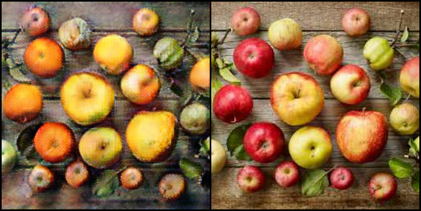
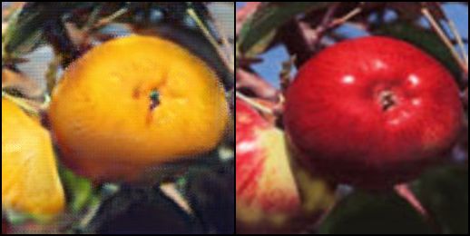
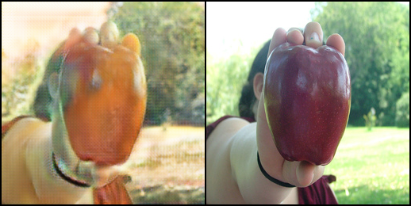
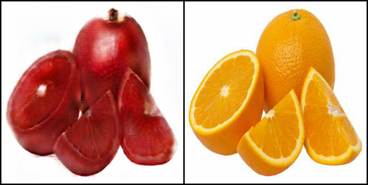
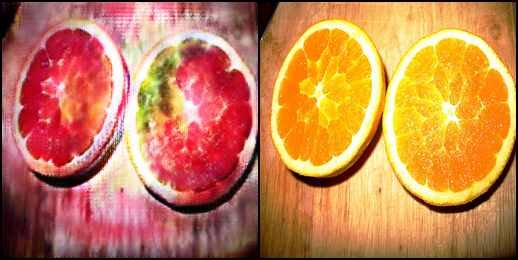
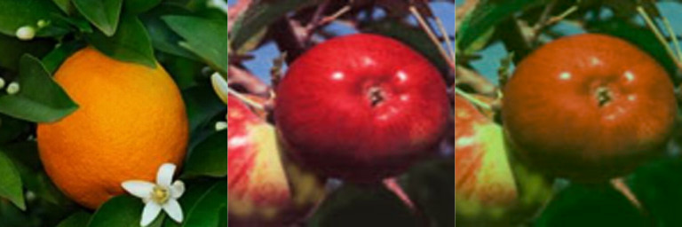
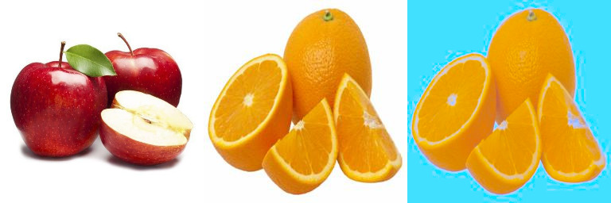

# Color-Tranfer Project

Using Pytorch for implementation of CycleGAN (https://arxiv.org/abs/1703.10593)

## Goal
1.  (Training cycleGAN)
2.  (Inference cycleGAN in personal image)
3.  (Compare with other method)

## Getting Started
Please firstly install [Anaconda](https://anaconda.org), if you not understand how to install whole procedures on Ubuntu system, you can take this [link](https://stackoverflow.com/questions/28852841/install-anaconda-on-ubuntu-via-command-line) as reference.


After finishing, you need to create an Anaconda environment using the environment.yml file.

```
conda env create -f environment.yml
```

After you create the environment, activate it.
```
source activate hw1
```

Our current implementation supports GPU Card (Such as GTX-1060 up), you must have one GPU (like GTX-1080 ti) and have CUDA libraries installed on your machine. 

**(Don't use VMs running on Ubuntu Operation, because VMs can not get the real GPU card)**

## Training
### 1. Download dataset

your need to create one folder named datasets
```
mkdir datasets
```

and then,
```
cd datasets
```
Implement the instruction
```
bash ./download_dataset.sh <dataset_name>
```
Valid <dataset_name> are: apple2orange, summer2winter_yosemite, horse2zebra, monet2photo, cezanne2photo, ukiyoe2photo, vangogh2photo, maps, cityscapes, facades, iphone2dslr_flower, ae_photos (Here we use apple2roange)

Alternatively you can build your own dataset by setting up the following directory structure:

    .
    ├── datasets                   
    |   ├── <dataset_name>         # i.e. apple2orange
    |   |   ├── trainA             # Contains domain A images (i.e. apple)
    |   |   ├── trainB             # Contains domain B images (i.e. orange) 
    |   |   ├── testA              # Testing
    |   |   └── testB              # Testing
    
### 2. Train

Start to train, type the command as follow: 

```
python train.py --dataroot datasets/<dataset_name>/ --cuda
```

This command would start a training session using the images under the *dataroot/train* directory with the hyperparameters that showed best results according to CycleGAN authors. 

Both generators and discriminators weights will be saved ```./output/<dataset_name>/``` the output directory.

**If you don't own one GPU, remove the --cuda option, but you had better get one, becaue it is faster than CPU !**

## Testing
After training, we can start to test.

The pre-trained file is on [Google drive](https://drive.google.com/open?id=17FREtttCyFpvjRJxd4v3VVlVAu__Y5do). Download the file and save it on  ```./output/<dataset_name>/netG_A2B.pth``` and ```./output/<dataset_name>/netG_B2A.pth```. 

```
python test.py --dataroot datasets/<dataset_name>/ --cuda
```
This command will take the images under the ```dataroot/testA/``` and ```dataroot/testB/``` directory, run them through the generators and save the output under the ```./output/<dataset_name>/``` directories. 

Examples of the generated outputs (default params) apple2orange, summer2winter_yosemite, horse2zebra dataset:


**Next we use our Personal image to test.**

output/apple2orange/A folder, we test 3 pictures：





output/apple2orange/B folder：





After using CycleGAN for train and test, we also use the approach of **fast-coler transfer** to compare.

------------ Source  ------------> Target ------------> Result







**references:**
[Super fast color transfer between images](https://github.com/jrosebr1/color_transfer)

## Acknowledgments

Code is modified by [PyTorch-CycleGAN](https://github.com/aitorzip/PyTorch-CycleGAN). All credit goes to the authors of [CycleGAN](https://arxiv.org/abs/1703.10593), Zhu, Jun-Yan and Park, Taesung and Isola, Phillip and Efros, Alexei A.


